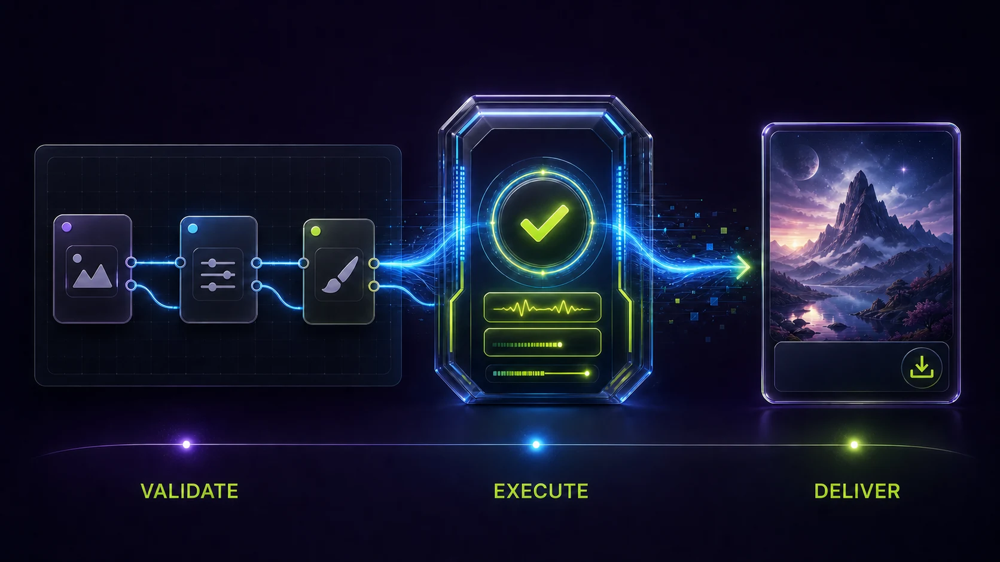

# dcc-mcp-comfyui

<p align="center">
  <picture>
    <source media="(prefers-color-scheme: dark)" srcset="docs/assets/dcc-mcp-comfyui-dark.svg">
    <source media="(prefers-color-scheme: light)" srcset="docs/assets/dcc-mcp-comfyui.svg">
    
  </picture>
</p>

Production ComfyUI adapter for the DCC Model Context Protocol (MCP) ecosystem. It gives agents a typed, bounded path from API-format workflow validation to queue execution and artifact delivery through ComfyUI's local REST API.



_Illustrative workflow generated with OpenAI ImageGen from the retained source in `docs/assets/sources`; it depicts only the implemented validation, queue, polling, and artifact-delivery path._

## Capabilities

- Workflow validation checks API-format structure, graph references, live node classes, and required inputs before queue submission.
- Catalog discovery exposes bounded features, models, embeddings, node summaries, exact node contracts, and redacted device/runtime status.
- Queue operations inspect IDs without workflow bodies, target one exact prompt for cancellation or history deletion, and verify the resulting state; running cancellation fails closed instead of falling back to ComfyUI's legacy global interrupt.
- Asset handoff uploads bounded images with SHA-256 provenance and atomically downloads only artifacts proven to belong to the requested prompt.
- Artifact discovery is shape-based rather than tied to English labels or an image-only key, so file-shaped image, animation, video, audio, 3D, and custom-node outputs share one bounded contract.
- Standalone discovery, packaged Skill subprocesses, and six-part DCC-MCP readiness are supported out of the box.

The production path was live-validated on ComfyUI 0.32.0 with a three-node `EmptyImage -> ImageInvert -> SaveImage` workflow, including typed validation, execution, status polling, and artifact retrieval.

## Quick Start

```bash
# Install
pip install dcc-mcp-comfyui

# Start ComfyUI locally (in another terminal)
python main.py --listen 127.0.0.1

# Start the MCP server
dcc-mcp-comfyui --comfyui-base-url http://127.0.0.1:8188
```

## Environment Variables

| Variable | Default | Description |
|---|---|---|
| `DCC_MCP_COMFYUI_BASE_URL` | `http://127.0.0.1:8188` | ComfyUI server URL |
| `DCC_MCP_COMFYUI_TIMEOUT` | `120` | Request timeout (seconds) |
| `DCC_MCP_COMFYUI_PORT` | OS-assigned | MCP instance port |
| `DCC_MCP_GATEWAY_PORT` | `9765` | Gateway port |
| `DCC_MCP_COMFYUI_ENABLE_GATEWAY_FAILOVER` | `true` | Gateway failover |

## Skills

The wheel includes four validated Skills and 17 typed tools:

| Skill | Tools | Boundary |
|---|---:|---|
| `comfyui-workflow` | 4 | Validate, submit, monitor, and resolve exact prompt-owned artifacts |
| `comfyui-catalog` | 7 | Features, model folders, models, embeddings, node summaries/contracts, and redacted runtime status |
| `comfyui-queue` | 4 | Redacted queue inspection, exact cancellation/history deletion, and memory reclamation |
| `comfyui-assets` | 2 | Bounded image upload and atomic prompt-owned artifact download |

The public surface does not expose arbitrary Python, raw process arguments,
local ComfyUI install paths, bulk queue deletion, or unbounded catalog dumps.

## MCP Client Config

```json
{
  "mcpServers": {
    "dcc-mcp-comfyui": {
      "url": "http://127.0.0.1:9765/mcp"
    }
  }
}
```

## Build & Test

```bash
uv pip install -e ".[dev]"
uv run pytest
uv run ruff check src/ tests/
```

## Architecture

```
MCP Client → Gateway (:9765) → ComfyUiMcpServer (OS port)
    └─ Skill scripts → ComfyUIBridge → ComfyUI REST API (:8188)
```

## License

MIT
