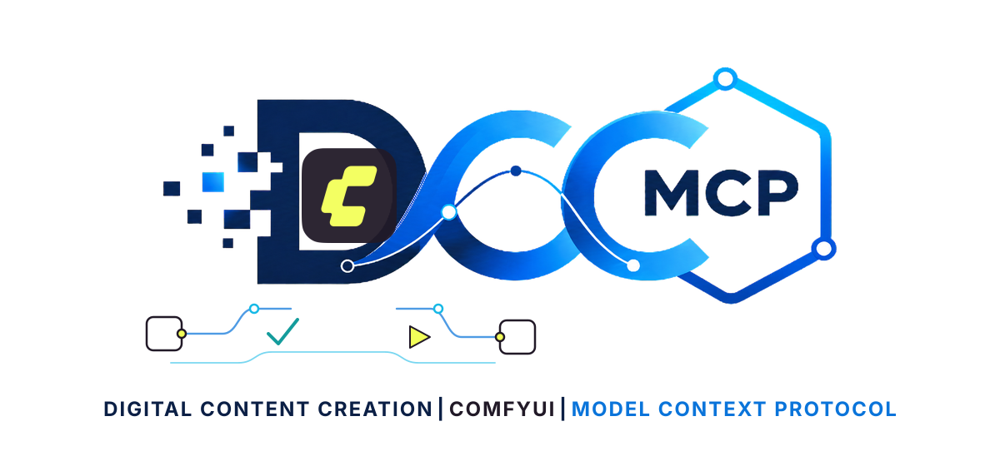
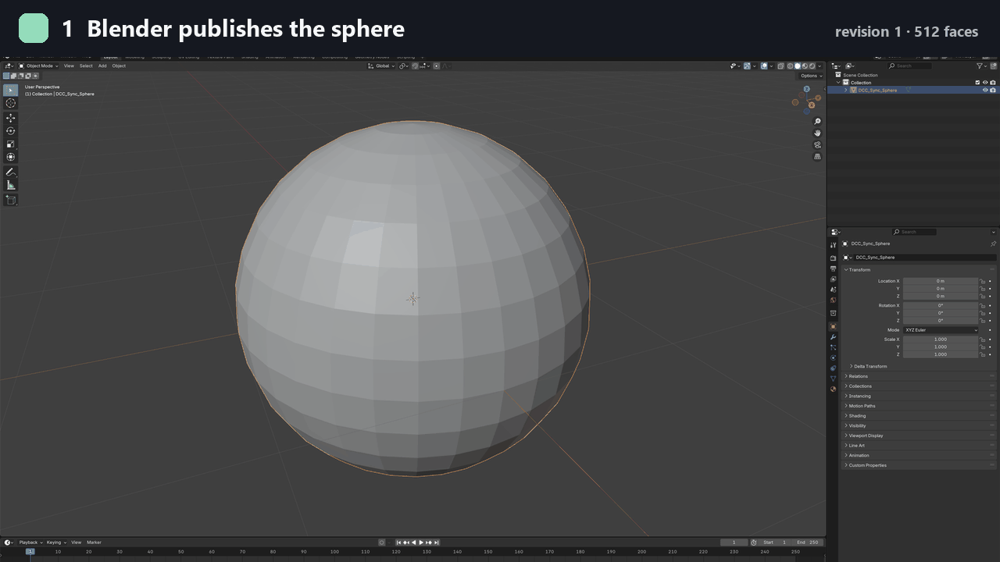

# dcc-mcp-comfyui

[English](README.md) | 简体中文

<p align="center">
  <picture>
    <source media="(prefers-color-scheme: dark)" srcset="docs/assets/dcc-mcp-comfyui-dark.svg">
    <source media="(prefers-color-scheme: light)" srcset="docs/assets/dcc-mcp-comfyui.svg">
    
  </picture>
</p>

DCC-MCP 的 ComfyUI 适配器，让 AI Agent 通过本地 REST API 验证工作流、提交队列任务并取回产物。
可用于生成游戏 UI 插画、图标、透明 PNG 和 GLB 道具：先帮助用户选择方案，再检查实时宿主、提交任务并交付文件供验收。



真实本地录制：Blender 球体 → 半球网格修订 → 按内容寻址发布 → ComfyUI `Load3D` 点击刷新。
[可复现的单节点工作流](docs/showcase/comfyui-load3d-preview.json)。

## 能力

- 九种本地游戏素材配方：SD1.5、SDXL、FLUX.2 Klein 4B、Z-Image Turbo、Qwen-Image 2512、BiRefNet、Hunyuan3D 2、TRELLIS.2 PBR、Pixal3D PBR；包含方案确认、硬件提示、节点/模型预检和 PNG/GLB 提交。
- 提交前验证 API 格式、图引用、实时节点类型和必填输入。
- 有界查询特性、模型、embedding、节点契约和脱敏运行时状态。
- 查询队列 ID，对单个精确 prompt 取消或删除历史，并回读验证；运行中取消不回退到全局中断。
- 图片上传包含 SHA-256 来源记录；仅原子下载能证明属于指定 prompt 的产物。
- 按文件结构发现图片、动画、视频、音频、3D 和自定义节点产物。
- `stage_3d_asset` 从配置的导出根目录发布按内容寻址的修订，暂存到 ComfyUI `input/3d`。
- 随包扩展提供画布上的 **Update to latest DCC revision** 操作，通过原子指针定位最新修订。
- 支持独立发现、打包 Skill 子进程与 DCC-MCP 六项就绪检查。

已有 ComfyUI 0.32.0 的 `EmptyImage → ImageInvert → SaveImage` 实机验证记录，覆盖类型化验证、执行、状态查询和产物读取。

## ComfyUI MCP 可以免费在本地生成游戏素材吗？

可以，前提是单独准备模型和兼容硬件。九种配方使用本地节点，无需付费 Partner Nodes。
模型下载、硬件、电力和许可条件仍然适用；适配器的 MIT 许可不能代替模型权重和依赖的许可。

| 目标 | 配方 | 输出与取舍 |
|---|---|---|
| 较低负担的草稿 | SD1.5 (`sd15`) | 默认 512 像素，经济型图片候选 |
| 风格化图标与插画 | SDXL (`sdxl`) | 默认 1024 像素，成熟 checkpoint 工作流 |
| 快速 UI 插画与概念图 | FLUX.2 Klein 4B (`flux2-klein-4b`)、Z-Image Turbo (`z-image-turbo`) | 现代图片模型，先核实空闲显存 |
| 复杂插画与招牌 | Qwen-Image 2512 (`qwen-image-2512`) | 较重；生成文字需校对 |
| 透明 PNG 素材 | BiRefNet (`birefnet-cutout`) | 对已有图片去背景 |
| 无贴图 GLB 形状 | Hunyuan3D 2 (`hunyuan3d-2`) | 图片转网格，有单独许可条件 |
| PBR 贴图 GLB 道具 | TRELLIS.2 (`trellis2-pbr`)、Pixal3D (`pixal3d-pbr`) | 图片转 3D、UV、基础色/金属度/粗糙度贴图 |

### 本地显卡适合什么方案？

先看输出目标和**空闲**显存。SD1.5 是较低负担的图片候选；只需形状时可以比较 Hunyuan3D 与更重的 PBR 管线。
本项目尚未实测每种配方的峰值显存，权重下载体积也不等于推理内存。
给用户两三个合适选项，下载或生成前沿用用户已作出的选择。

[方案选择与安装指引](src/dcc_mcp_comfyui/skills/comfyui-game-assets/references/selection-guide.md)
包含 Pixal3D、本地显存取舍、许可、图片上传、OOM 恢复和引擎验收；另有
[English guide](src/dcc_mcp_comfyui/skills/comfyui-game-assets/references/selection-guide.en.md)。

### 如何让 Agent 使用这些配方？

```text
使用 dcc-mcp，在 ComfyUI 中帮我生成奇幻宝箱图标和带贴图的 GLB 道具。
先检查可用硬件和已装模型，比较合适的本地方案；下载模型或排队生成前让我选择。
我已经选定方案时直接沿用。图片生成后先给我查看，再作为 3D 参考图。
报告 prompt ID、终态、产物路径以及尚需完成的游戏引擎检查。
```

随包 `comfyui-game-assets` Skill 提供 `list_asset_recipes`（离线发现）、
`prepare_asset_workflow`（实时依赖预检）、`generate_asset`（单次提交）。
先在指定 ComfyUI 实例发现并描述工具；提交后查询到终态，再下载该 prompt 的产物。
CLI 通用接入参见[官网 Agent 工作流](https://dcc-mcp.github.io/zh/agents)。

### 已安装版本包含新配方吗？

检查连接的宿主是否能发现 `comfyui-game-assets`，不能只看包版本。
截至 2026-09-05，九种配方已合并到源码 `94ccac8`，最新公开包 **0.1.4** 早于这些改动。
可在单独的 Python 环境中测试这个固定合并版本：

```bash
pip install "dcc-mcp-comfyui @ git+https://github.com/dcc-mcp/dcc-mcp-comfyui.git@94ccac8265257e74ef8c964be61fcc2bce33d3cd"
```

之后按下文启动适配器。包含此 Skill 的安装包发布情况以[发布记录](https://github.com/dcc-mcp/dcc-mcp-comfyui/releases)为准。
该命令不安装模型权重。源码测试和 CPU CI 证明节点契约及无模型 PNG 往返；不证明九种模型的 GPU 推理、画质或游戏可用性。
[本轮验证记录](docs/audits/2026-09-05-game-assets-geo.md)。

## 快速开始

ComfyUI 不在线时，Agent 会先说明连接状态，提供启动/配置已有安装或安装缺失组件的方案，
展示计划并等待授权。授权后完成配置、连接适配器、发现工具和约定的验证；已经授权的范围
不重复询问。[离线宿主配置流程](install.md#offline-host-handoff-and-authorization)。

[安装 SOP](install.md) 包含 JSON doctor、自定义节点事务安装、验证、升级和卸载。

```bash
pip install dcc-mcp-comfyui
dcc-mcp-comfyui install --json --dry-run --dcc-path /absolute/path/to/ComfyUI
# 检查安装计划后，使用 --yes 执行。另开终端启动 ComfyUI：
python main.py --listen 127.0.0.1
# 启动适配器：
dcc-mcp-comfyui --comfyui-base-url http://127.0.0.1:8188
```

启用有界 3D 同步前，配置两个可信目录（以下为 Windows cmd 示例）：

```bat
set DCC_MCP_COMFYUI_SYNC_SOURCE_ROOT=G:\dcc-sync\exports
set DCC_MCP_COMFYUI_INPUT_DIR=G:\apps\ComfyUI\input
dcc-mcp-comfyui --comfyui-base-url http://127.0.0.1:8188
```

## 环境变量

| 变量 | 默认 | 用途 |
|---|---|---|
| `DCC_MCP_COMFYUI_BASE_URL` | `http://127.0.0.1:8188` | ComfyUI 服务 URL |
| `DCC_MCP_COMFYUI_TIMEOUT` | `120` | 请求超时秒数 |
| `DCC_MCP_COMFYUI_SYNC_SOURCE_ROOT` | 未设 | `stage_3d_asset` 允许读取的导出根目录 |
| `DCC_MCP_COMFYUI_INPUT_DIR` | 未设 | ComfyUI input 根目录 |
| `DCC_MCP_COMFYUI_SYNC_MAX_ASSET_BYTES` | `268435456` | 3D 文件大小上限 |
| `DCC_MCP_COMFYUI_PORT` | 系统分配 | MCP 实例端口 |
| `DCC_MCP_GATEWAY_PORT` | `9765` | Gateway 端口 |
| `DCC_MCP_COMFYUI_ENABLE_GATEWAY_FAILOVER` | `true` | Gateway 故障切换 |

## Skills

当前源码打包五个 Skill 和 21 个类型化工具：

| Skill | 工具数 | 范围 |
|---|---:|---|
| `comfyui-workflow` | 5 | 验证、提交、监控、产物定位和版本化 3D 暂存 |
| `comfyui-catalog` | 7 | 特性、模型、embedding、节点契约和运行状态 |
| `comfyui-queue` | 4 | 脱敏队列、精确取消/历史删除和内存回收 |
| `comfyui-assets` | 2 | 有界图片上传和 prompt 所属产物下载 |
| `comfyui-game-assets` | 3 | 离线配方目录、实时依赖预检和单次生成提交 |

配方记录固定的上游工作流、权重位置与许可。权重不随包提供，也不自动安装。
硬件分档是相对提示；预检不证明显存适配或画质。新 3D/去背景节点可能需要比资产同步 CI 基线更新的 ComfyUI。
图片和网格仍需检查透明边缘、文字、拓扑、碰撞和 LOD。
公开工具不暴露任意 Python、原始进程参数、本地安装路径、批量队列删除或无界目录转储。

## MCP 客户端配置

```json
{
  "mcpServers": {
    "dcc-mcp-comfyui": {"url": "http://127.0.0.1:9765/mcp"}
  }
}
```

## 构建与测试

```bash
uv pip install -e ".[dev]"
uv run pytest
uv run ruff check src/ tests/
```

## 架构

```text
MCP 客户端 → Gateway (:9765) → ComfyUiMcpServer（系统分配端口）
    ├─ Workflow scripts → ComfyUIBridge → ComfyUI REST API (:8188)
    └─ 资产同步 → 按内容寻址的修订 → 配置的 ComfyUI input/3d
```

## 许可

MIT。模型与依赖许可见各配方和选择指南。
